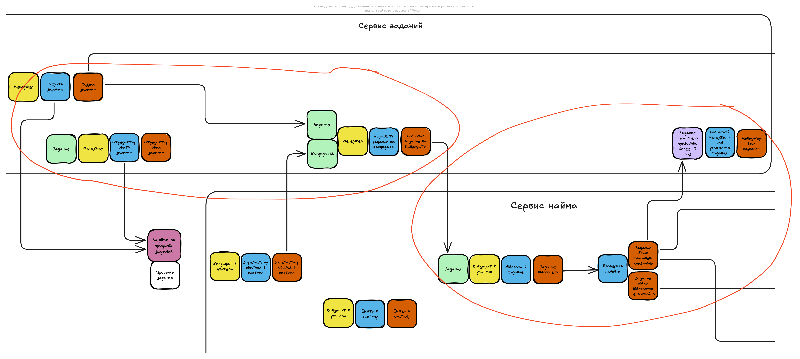
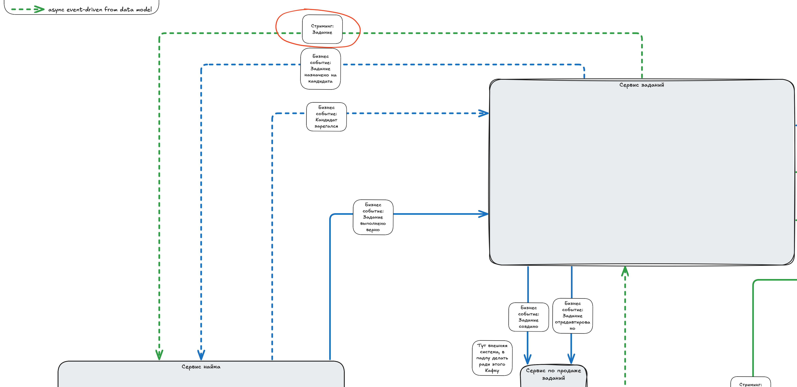
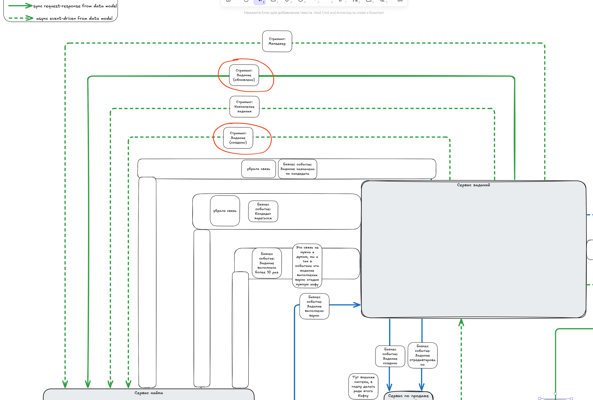

# ADR 1: Исправляем eventual consistency между сервисами заданий и найма для обновленных/созданных заданий

# Status
Accepted

# Context
У бизнеса был запрос: менеджер может:

1. Создавать задание для кандидата.
2. Редактировать задание (изменить если нашел ошибку / усложнить если его много раз верно решили).
3. Назначать задание для кандидата.

С точки зрения бизнес процессов это выглядело следующим образом:

В первой итерации разработки системы передача заданий из сервиса заданий в сервис найма (после назначения задания менеджером),
где кандидат мог решить задание, была реализована единственной асинхронной event-driven коммуникацией.

К сожалению возникла непредвиденная проблема:

* Кандидаты в учителя читерят систему в месте, где простое задание должно усложниться, но этого ещё не произошло. Для этого они собираются в группы, где делятся лёгкими заданиями между собой, и, пока задание обновляется, пачкой выполняют лёгкие версии.

Она возникла из-за eventual consistency между сервисом заданий и найма для ОБНОВЛЕННЫХ заданий, из-за
использования единственной асинхронной event-driven коммуникации для создания и обновления заданий.

# Decision
Решение: разбить эти коммуникации на две:

* Для передачи созданных заданий оставить async event-driven коммуникацию, тк от бизнеса нет требований
для мгновенной передачи заданий, если его назначили на кандидата.
* Для передачи обновленных заданий сделать sync request-response коммуникацию, чтобы от eventual consistency
перейти к strong consistency, и кандидаты не могли читерить.

